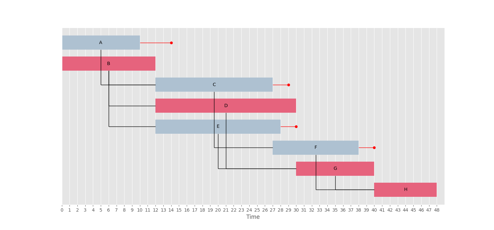

# Critical Path Method (CPM) Example

The **Critical Path Method (CPM)** is a project scheduling technique used to determine the sequence of activities that directly affects the total project duration.  
By identifying the *critical path*—the longest sequence of dependent tasks—you can see which activities have **zero slack** and must be completed on time to avoid delaying the project.

---

## 📊 CPM Network Diagram



**Activity – Description – Predecessors**

| Activity | Description                              | Predecessors |
|----------|------------------------------------------|--------------|
| A        | Clear site                               | -            |
| B        | Bring utilities to site                  | -            |
| C        | Excavate                                 | A            |
| D        | Pour foundation                          | C            |
| E        | Outside plumbing                         | B, C         |
| F        | Frame house                              | D            |
| G        | Do electric wiring                       | F            |
| H        | Lay floor                                | G            |
| I        | Lay roof                                 | F            |
| J        | Inside plumbing                          | E, H         |
| K        | Shingling                                | I            |
| L        | Outside sheathing insulation             | F, J         |
| M        | Install windows and outside doors        | F            |
| N        | Do brick work                            | L, M         |
| O        | Insulate walls and ceiling               | G, J         |
| P        | Cover walls and ceiling                  | O            |
| Q        | Insulate roof                            | I, P         |
| R        | Finish interior                          | P            |
| S        | Finish exterior                          | I, N         |
| T        | Landscape                                | S            |

---

## 📂 Project Structure

```
critical-path-method/
├── docs/
│   └── cpm.png                # CPM diagram
├── cpm_tasks.xlsx              # Excel file with job data
├── main.py                     # Python script
└── README.md                   # This file
```

---

## ▶️ How to Run

Install dependencies:

```bash
uv add pycritical pandas openpyxl
```

Run from the project root:

```bash
uv run ./section-7/critical-path-method/main.py
```

The script will:
1. Load tasks from `cpm_tasks.xlsx` (sheet: `example`).
2. Run CPM with **pyCritical**.
3. Print the CPM results.
4. Display a Gantt chart.

---

## 📚 References
- [pyCritical GitHub](https://github.com/Valdecy/pyCritical)
- [Critical Path Method – Wikipedia](https://en.wikipedia.org/wiki/Critical_path_method)
